<div align="center">
🚌 Campus Shuttle UX Case Study
Research → Structure → Prioritize → Design → Test → Refine → Implement
A research-driven UX/UI case study focused on reducing uncertainty while students wait for the campus shuttle.
<br>


</div>
---
✦ Project at a Glance
> **Students should not have to stand at a shuttle stop wondering whether the bus is coming, where it is, or why it is late.**
The Campus Shuttle UX Case Study investigates the uncertainty students experience while waiting for the campus shuttle and documents the complete UX process used to understand, structure, prioritize, design, evaluate, and refine the experience.
The project began with real-world observation and user research, rather than starting with a predetermined app solution. The End-Term work continues directly from the earlier research, Information Architecture, prioritization, and Final MVP.
📌 Quick Facts
	Details
Project	Campus Shuttle — Shuttle Information System
Domain	Campus Transportation / Student Mobility
Researcher	Ganesh Oraon
Approach	Research-first, evidence-based UX
Format	Interactive UX case-study website
Implementation	HTML + CSS + JavaScript
Evaluation	Heuristic Inspection + Usability Testing
Benchmarking	3 peer projects
Usability testing	5 formal participants
Recorded task completion	21 / 25 independent completions (84%)
---
🎯 The Problem
The project started from a real campus shuttle-stop observation.
Observation	Recorded detail
🕑 Scheduled arrival	2:15 PM
🚌 Observed arrival	Approximately 2:45 PM
👥 People observed	3 students
❓ Core issue	Students waited without clear shuttle information
📱 Observed behaviour	One student checked their phone
💬 Observed behaviour	Students asked each other about the delay
Core Pain Point
> **Students lack timely and understandable information about shuttle status, arrival, delays, and schedule changes while they are waiting.**
The project therefore focused on the information problem surrounding the wait, rather than assuming that technology itself was the solution.
---
🧭 UX Process
The project follows a continuous, research-first process:

```mermaid
flowchart LR
    A[Problem] --> B[Research]
    B --> C[Proto Persona]
    C --> D[Observation]
    D --> E[Persona + Empathy]
    E --> F[Pain Point + User Stories]
    F --> G[Card Sorting]
    G --> H[Information Architecture]
    H --> I[Tree Test]
    I --> J[Prioritization]
    J --> K[Final MVP]
    K --> L[Wireframing]
    L --> M[Heuristic Inspection]
    M --> N[Interactive Prototype]
    N --> O[Usability Testing]
    O --> P[Analysis]
    P --> Q[Next Iteration]
    Q --> R[Peer Benchmarking]
    R --> S[Functional Prototype]
    S --> T[System Behaviour]
    T --> U[Reflection]
```

Why this sequence matters
The interface was not treated as the starting point.
The process moved progressively from:
understanding users → defining the problem → structuring information → prioritizing needs → designing → evaluating → refining → implementing
---
🔎 Research & Definition
The case study documents the following research artifacts:
Stage	Artifact	Purpose
01	Proto Persona	Establish an initial user hypothesis
02	Observation Log	Record real behaviour at the shuttle stop
03	User Persona	Synthesize the researched user
04	Empathy Map	Understand what the user says, thinks, does and feels
05	Journey Map	Identify friction across the waiting experience
06	Pain Point	Narrow the problem to a specific user difficulty
07	User Stories	Translate the problem into user needs
08	Feature / Content List	Identify possible information needs
Research direction
The research narrowed the broader transportation problem into a specific information question:
> **“What is happening with the shuttle right now, and what should I expect next?”**
That distinction became important when creating the Information Architecture.
---
🗂 Information Architecture
Card Sorting
Card sorting was used to understand how participants grouped shuttle-related information.
The results informed the information categories instead of assuming that the designer's first grouping was automatically correct.
🌳 Tree Testing
The proposed structure was then evaluated through a tree test to check whether users could find information within the Information Architecture.
Final IA
```text
CAMPUS SHUTTLE
│
├── 🔵 Current Shuttle Status
├── 🟢 Expected Arrival Time
├── 🟡 Delay Information
└── 🟠 Schedule Change Alerts
```
The four categories became the foundation for the Final MVP.
---
⭐ Prioritization → Final MVP
Two prioritization approaches were used:
Method	Meaning
MoSCoW	Must · Should · Could · Won't
DFV	Desirability · Feasibility · Viability
Together, they narrowed the feature set to the information students most need during the shuttle-waiting situation.
Final Must-Haves
	Feature	Purpose
🔵	Current Shuttle Status	Understand the shuttle's current state and location
🟢	Expected Arrival Time	Know when the shuttle is expected
🟡	Delay Information	Understand delay, reason, updated arrival, and information freshness
🟠	Schedule Change Alerts	Know when the planned shuttle time changes
---
🎨 Design & Evaluation
After the Final MVP, the case study continues into the End-Term evaluation cycle:
```text
FINAL MVP
   ↓
WIREFRAMING
   ↓
HEURISTIC INSPECTION
   ↓
INTERACTIVE PROTOTYPE
   ↓
USABILITY TESTING
   ↓
USABILITY ANALYSIS
   ↓
NEXT ITERATION
   ↓
PEER BENCHMARKING
   ↓
FUNCTIONAL PROTOTYPE
   ↓
SYSTEM BEHAVIOUR
   ↓
REFLECTION
```
---
🖼 Wireframing
The prioritized MVP was translated into screen-level structures.
Prototype / screen set
Screen	Purpose
Current Shuttle Status	Shows the present shuttle state
Expected Arrival Time	Shows expected arrival
Delay Information	Explains delay and updated arrival
Schedule Change Alerts	Shows schedule changes
Loading State	Communicates information retrieval
Information Unavailable	Provides recovery when data cannot be retrieved
Schedule Update	Shows previous and new time
Interaction principle
The loading screen includes a Cancel action, giving the user a way to leave the operation rather than forcing them to wait.
---
🧪 Heuristic Inspection
The prototype was inspected using selected Nielsen usability heuristics.
Heuristic	Finding	Response
👁️ Visibility of System Status	Delay information did not initially show when it was last updated	Added Last Updated information
🎛️ User Control & Freedom	Expected Arrival loading state did not initially provide a way to leave	Added Cancel
🛡️ Error Prevention	Inspected, but not treated as a confirmed violation without supporting evidence	No unsupported claim added
Before → Issue → Fix
01 · Visibility of System Status
Issue: The delay screen did not show when its information was last updated.
Fix: Added updated arrival information, delay reason, and a Last Updated time.
---
02 · User Control & Freedom
Issue: The Expected Arrival loading state did not provide a clear way to leave the operation.
Fix: Added a Cancel action.
---
🔗 Interactive Prototype
The prototype demonstrates both the normal journey and alternative system states.
Main interaction flow
```text
Home
  │
  ├── Current Shuttle Status → Back → Home
  │
  ├── Expected Arrival
  │       ↓
  │    Loading
  │      ├── Cancel → Home
  │      └── Error → Try Again → Loading
  │                 └── Back → Home
  │
  ├── Delay Information → Back → Home
  │
  └── Schedule Change Alerts → Back → Home
```
States represented
✅ Normal information state
🔄 Loading
❌ Information unavailable
🔁 Retry
↩️ Cancel
← Back
🕑 Updated arrival
📅 Schedule change
---
👥 Usability Testing
The prototype was evaluated through a formal testing round with 5 participants.
Test Tasks
#	Task
01	Find the shuttle's current status and location
02	Find when the shuttle is expected to arrive
03	Find the shuttle delay information
04	Check whether the shuttle schedule has changed
05	Show what you would do if shuttle information cannot be retrieved
Recorded Result
<div align="center">
21 / 25
Independent task completions
84% documented completion rate
</div>
This represents the recorded outcome of this usability-testing iteration.
---
💡 What the Testing Revealed
Two areas of uncertainty were identified during testing.
Area	Potential confusion
🔵 Current Status vs Expected Arrival	Users could confuse where the shuttle is / what state it is in with when it is expected to arrive
🟠 Delay Information vs Schedule Change	Users could perceive these two concepts as similar
Design implication
The next iteration should make the distinction between:
> **NOW** → Current shuttle state
and
> **WHEN** → Expected arrival
more immediately understandable.
> ⚠️ **Evidence discipline:** These are proposed improvements based on the usability findings. They should not be presented as a second validated testing result.
---
🔁 Next Iteration
The next iteration proposes:
Clearer descriptions for overlapping categories
Stronger separation between Current Status and Expected Arrival
Clearer distinction between Delay Information and Schedule Change Alerts
These are proposed improvements, not additional validated testing results.
---
👥 Peer Benchmarking
Peer benchmarking was completed using the supplied benchmarking records.
Comparison dimensions
```text
Problem
   ↓
Information Architecture
   ↓
Must-Have Selection
   ↓
Main User Task
   ↓
Error / Alternative States
   ↓
Difference from Campus Shuttle
   ↓
Why that approach
   ↓
What I learned
```
Benchmarked projects
Peer Project	Core Domain
Peer 1	Administrative Request Tracking
RouteMate	Travel / Route Planning
SmartSeat	Dining-Hall Seat Reservation
The benchmark considers how different projects structure information, prioritize needs, handle alternative states, and approach their respective user problems.
---
💻 Functional Coded Prototype
The final case study includes a coded prototype representation.
Conceptual architecture
```text
┌─────────────────┐
│      USER       │
└────────┬────────┘
         ↓
┌─────────────────┐
│ UI / FRONTEND   │
│   HTML CSS JS   │
└────────┬────────┘
         ↓
┌─────────────────┐
│ BACKEND / API   │
│   Flask/Python  │
└────────┬────────┘
         ↓
┌─────────────────┐
│  SHUTTLE DATA   │
└────────┬────────┘
         ↓
┌─────────────────┐
│ UPDATED STATE   │
└─────────────────┘
```
> The implementation is documented as a **prototype**, rather than being presented as production-grade live transportation infrastructure.
---
⚙️ System Behaviour
The prototype considers more than the ideal success path.
🟢 Normal
The interface can display:
Shuttle status
Current location
Expected arrival
Update time
🔵 Loading
```text
Loading...

Please wait while arrival information
is being retrieved.

[ Cancel ]
```
🔴 Information Unavailable
```text
SHUTTLE INFORMATION
UNAVAILABLE

We couldn't retrieve the latest
shuttle information.

Please try again.

[ Try Again ]
[ Back ]
```
🟠 Schedule Update
```text
Schedule Updated

Previous time → New time
```
These states make system behaviour visible and provide recovery options.
---
📚 Evidence Discipline
A major principle of this case study is separating evidence from design decisions and future proposals.
Type	Meaning
🔎 Researched	Supported by observation, research activities, card sorting, tree testing, usability testing, or supplied peer records
🎨 Designed	Interface decisions made in response to those findings
💡 Proposed	Future improvements that have not yet been validated through another testing round
This distinction prevents assumptions from being presented as research evidence.
---
🎨 Visual Design
The final website intentionally continues the visual language established in the earlier case study.
Role	Typeface
Display headings	Fraunces
Body / Interface	Public Sans
Metadata / Labels	JetBrains Mono
Visual language
🟤 Warm paper / cream background
⚫ Dark ink typography
🔵 Blue accent
🟢 Teal accent
🟡 Ochre accent
🟠 Clay accent
Thin borders
Small-radius cards
Structured editorial grids
Evidence-first image presentation
Phase-based navigation
Lightbox image viewing
Responsive layouts
The End-Term work is designed to feel like a continuation of the same case study, not a separate website.
---
📁 Repository Structure
```text
Campus-Shuttle-UX-Case-Study/
│
├── index.html
├── style.css
├── README.md
│
└── images/
    ├── card-sort.jpg
    ├── dfv.jpg
    ├── empathy-map.jpg
    ├── features.jpg
    ├── heuristic-fixes-notes.jpg
    ├── heuristic-notes.jpg
    ├── ia.jpg
    ├── journey-map.jpg
    ├── moscow.jpg
    ├── observation-log.jpg
    ├── pain-point-stories.jpg
    ├── proto-persona.jpg
    ├── prototype-alerts.jpg
    ├── prototype-arrival.jpg
    ├── prototype-delay.jpg
    ├── prototype-error.jpg
    ├── prototype-home.jpg
    ├── prototype-loading.jpg
    ├── prototype-status.jpg
    ├── tree-test.jpg
    ├── user-persona-1.jpg
    └── user-persona-2.jpg
```
---
🛠 Technology
Technology	Use
HTML5	Page structure and content
CSS3	Layout, styling and responsive presentation
JavaScript	Prototype interactions where applicable
GitHub	Version control and repository hosting
GitHub Pages	Static website deployment
No build step is required for the static case-study presentation.
---
▶️ Run Locally
Option 1 — Open directly
Open:
```text
index.html
```
Option 2 — VS Code
Open the project folder in VS Code.
Keep the `images/` folder beside `index.html`.
Open `index.html` with a local development extension such as Live Server.
The case study will open in your browser.
⚠️ Important
Keep the expected folder structure intact:
```text
index.html
style.css
images/
```
If image filenames or folder paths are changed, image references in the HTML may stop working.
---
🧩 Key Outcome
The project progressed from a real observed waiting problem into a structured UX process:
```text
OBSERVE
   ↓
UNDERSTAND
   ↓
STRUCTURE
   ↓
PRIORITIZE
   ↓
DESIGN
   ↓
PROTOTYPE
   ↓
TEST
   ↓
LEARN
   ↓
REFINE
   ↓
BENCHMARK
   ↓
IMPLEMENT
```
The most important outcome is not simply the final interface.
It is the documented connection between:
> **what users experienced → what was discovered → what was prioritized → what was designed → what was tested → what was learned → what was changed**
---
<div align="center">
🚌 Campus Shuttle
Research-driven · Evidence-based · Iterative
From “Where is the shuttle?”
to
“I know what is happening.”
<br>
UX/UI Case Study · Ganesh Oraon
</div>
