<div align="center">
🚌 Campus Shuttle
UX Case Study · Research → Design → Evaluation → Implementation
A research-driven campus transportation experience for reducing uncertainty while students wait for the shuttle.
<br>
🎯 Problem	🧠 Research	🧩 Design	🧪 Evaluation	💻 Prototype
Shuttle uncertainty	Observation + user research	IA + MVP + wireframes	Heuristics + usability testing	HTML/CSS/JS prototype
<br>
21 / 25  
independent task completions
84%  
documented completion rate
3  
peer projects benchmarked
</div>
---
✦ Project at a glance
> **Students should not have to stand at a shuttle stop wondering whether the bus is coming, where it is, or why it is late.**
The Campus Shuttle project explores how a simple information experience can make shuttle waiting more understandable and predictable.
The project was developed as a continuous UX case study. The End-Term work continues directly from the original Mid-Term research, Information Architecture, prioritization, and Final MVP instead of becoming a separate visual redesign.
The four final Must-Haves
	Feature	What the student needs
🔵	Current Shuttle Status	Understand the shuttle's current state and location
🟢	Expected Arrival Time	Know when the shuttle is expected
🟡	Delay Information	Understand delay duration, reason, updated arrival, and information freshness
🟠	Schedule Change Alerts	Know when the planned shuttle time changes
---
01 · The problem
What was observed?
The project started from a real campus shuttle-stop observation rather than from a predetermined app idea.
Scheduled arrival: 2:15 PM
Observed arrival: approximately 2:45 PM
People observed: three students
Students waited without clear shuttle information.
Students asked each other about the delay.
One student checked their phone.
The uncertainty became part of the transportation problem.
Core pain point
> **Students lack timely and understandable information about shuttle status, arrival, delays, and schedule changes while they are waiting.**
---
02 · UX journey
The project follows a research-first process:

```mermaid
flowchart LR
    A[Problem] --> B[Research]
    B --> C[Proto Persona]
    C --> D[Observation]
    D --> E[Persona + Empathy]
    E --> F[Pain Point + User Stories]
    F --> G[Card Sorting]
    G --> H[Information Architecture]
    H --> I[Tree Test]
    I --> J[Prioritization]
    J --> K[Final MVP]
    K --> L[Wireframing]
    L --> M[Heuristic Inspection]
    M --> N[Interactive Prototype]
    N --> O[Usability Testing]
    O --> P[Analysis]
    P --> Q[Next Iteration]
    Q --> R[Peer Benchmarking]
    R --> S[Functional Prototype]
    S --> T[System Behaviour]
    T --> U[Reflection]
```

Why this sequence matters
The interface was not treated as the starting point.
The project first investigated the users and the problem, then progressively moved toward structure, prioritization, interface design, evaluation, and implementation.
---
03 · Research & definition
🔎 Research artifacts
The case study documents:
Proto Persona
Observation Log
User Persona
Empathy Map
Journey Map
Pain Point
User Stories
Feature / content list
Research direction
The research narrowed a broad transportation problem into a specific information problem:
> **What is happening with the shuttle right now, and what should I expect next?**
That distinction became important when the Information Architecture was created.
---
04 · Information Architecture
🗂 Card Sorting
Card sorting was used to understand how participants grouped shuttle-related information.
The results informed the content categories rather than assuming that the designer's first grouping was automatically correct.
🌳 Tree Test
The proposed structure was then evaluated through a tree test to check whether users could find information within the IA.
Final IA
```text
CAMPUS SHUTTLE
│
├── 🔵 Current Shuttle Status
├── 🟢 Expected Arrival Time
├── 🟡 Delay Information
└── 🟠 Schedule Change Alerts
```
The structure follows the four core information needs that became the Final MVP.
---
05 · Prioritization → Final MVP
Two prioritization approaches were used:
MoSCoW
Must · Should · Could · Won't
DFV
Desirability · Feasibility · Viability
Together, they helped reduce the feature set to the information students most need during the shuttle-waiting situation.
Final MVP
Priority	Feature	Purpose
🔵 MUST	Current Shuttle Status	Current state + location
🟢 MUST	Expected Arrival Time	Expected arrival
🟡 MUST	Delay Information	Delay + reason + updated arrival
🟠 MUST	Schedule Change Alerts	Changed schedule
---
06 · Build, evaluate & refine
After the Final MVP, the case study continues into the End-Term evaluation cycle:
```text
FINAL MVP
   │
   ├── Wireframing
   │
   ├── Heuristic Inspection
   │
   ├── Interactive Prototype
   │
   ├── Usability Testing
   │
   ├── Usability Analysis
   │
   └── Next Iteration
```
---
07 · Wireframing
The MVP was translated into screen-level structures.
Prototype screen set
Screen	Purpose
Current Shuttle Status	Shows present shuttle state
Expected Arrival Time	Shows expected arrival
Delay Information	Explains delay and updated arrival
Schedule Change Alerts	Shows schedule changes
Loading State	Communicates information retrieval
Information Unavailable	Provides recovery when data cannot be retrieved
Schedule Update	Shows previous and new time
Interaction principle
The loading screen includes Cancel, giving the user a way to leave the operation rather than forcing them to wait.
---
08 · Heuristic inspection
The prototype was inspected using Nielsen's usability heuristics.
Heuristics checked
Heuristic	Finding
👁️ Visibility of System Status	Delay information did not initially show when it was last updated
🎛️ User Control & Freedom	Expected Arrival loading state did not initially provide a way to leave
🛡️ Error Prevention	Considered during inspection, but not treated as a confirmed violation without supporting evidence
Finding → Fix
01 · Visibility of System Status
Problem
The delay screen did not show when its information was last updated.
Why it matters
Users may not know whether the displayed delay is still current.
Fix
Add:
> **Last Updated: 02:10 PM**
---
02 · User Control & Freedom
Problem
The Expected Arrival loading state did not provide a clear way to leave the operation.
Why it matters
The user could feel stuck while information was being retrieved.
Fix
Add:
> **Cancel**
---
09 · Interactive prototype
The prototype demonstrates both the normal journey and alternative system states.
```text
                    ┌─────────────────────┐
                    │   Campus Shuttle    │
                    └──────────┬──────────┘
                               │
        ┌──────────────────────┼──────────────────────┐
        ↓                      ↓                      ↓
 Current Status          Expected Arrival       Delay Information
        │                      │                      │
        │                ┌─────┴─────┐                │
        │                ↓           ↓                │
        │             Loading     Unavailable         │
        │                │           │                │
        │             Cancel      Try Again            │
        │                            │                 │
        └────────────────────────────┴─────────────────┘
                               │
                               ↓
                    Schedule Change Alerts
```
States represented
Normal
Loading
Error / information unavailable
Retry
Cancel
Back
Updated arrival
Schedule change
---
10 · Usability testing
The prototype was evaluated through a formal testing round.
Participants
5 participants
Tasks
The tasks focused on the core information architecture:
Find the current shuttle status.
Find the expected arrival time.
Find delay information.
Find schedule changes.
Respond appropriately when shuttle information is unavailable.
Results
<div align="center">
21 / 25
independent task completions
84% documented completion rate
</div>
The result is the recorded outcome of this usability-testing iteration.
---
11 · What the testing revealed
Testing was not treated as a simple validation exercise.
Two areas of uncertainty were identified.
🔵 Current Status vs Expected Arrival
Users could confuse:
Current Status → where the shuttle is / what state it is in
Expected Arrival → when the shuttle is expected to arrive
🟠 Delay Information vs Schedule Change
These concepts could also feel similar.
Feature	Meaning
Delay Information	Explains the current delay and updated arrival context
Schedule Change Alerts	Communicates that the planned schedule itself changed
Design implication
The next iteration should make the distinction between:
> **NOW** → current shuttle state
and
> **WHEN** → expected arrival
more immediately understandable.
---
12 · Next iteration
The next iteration proposes clearer descriptions and stronger separation between overlapping information categories.
> ⚠️ **Important:** these are proposed improvements based on the usability findings. They should not be presented as a second validated testing result.
This distinction keeps the case study honest about what was tested versus what was proposed.
---
13 · Peer benchmarking
Peer benchmarking was completed using the supplied Peer Benchmarking and Final Insights spreadsheet.
Comparison dimensions
```text
Problem
  ↓
Information Architecture
  ↓
Must-Have selection
  ↓
Main User Task
  ↓
Error / Alternative States
  ↓
Difference from Campus Shuttle
  ↓
Why that approach
  ↓
What I learned
```
👥 Peer projects
Peer	Project	Core domain
Peer 1	Administrative Request Tracking System	Administrative requests
Peer 2	RouteMate	Travel / route planning
Peer 3	SmartSeat	Dining-hall seat reservation
Administrative Request Tracking System
The benchmark record covers the project's problem, IA, Must-Have reasoning, main task, alternative/error states, difference from Campus Shuttle, rationale, and learning.
RouteMate
The benchmark record covers the same dimensions, allowing the transportation-related peer to be compared without forcing it to have the same information architecture as Campus Shuttle.
SmartSeat
The benchmark record covers the same dimensions, with the focus on how a different campus problem organizes information and prioritizes user needs.
> **The complete peer records are presented in the website itself and were sourced from the supplied benchmarking sheet.**
---
14 · Functional coded prototype
The final case study includes the coded prototype representation.
Conceptual architecture
```text
┌───────────────┐
│     USER      │
└───────┬───────┘
        ↓
┌───────────────┐
│  UI / FRONTEND│
│ HTML CSS JS   │
└───────┬───────┘
        ↓
┌───────────────┐
│ BACKEND / API │
│ Flask / Python│
└───────┬───────┘
        ↓
┌───────────────┐
│ SHUTTLE DATA  │
└───────┬───────┘
        ↓
┌───────────────┐
│ UPDATED STATE │
└───────────────┘
```
The implementation is documented as a prototype rather than being presented as a production-grade live transportation infrastructure.
---
15 · System behaviour
The prototype considers more than the ideal success path.
🟢 Normal
Information is available and the interface displays:
shuttle status
current location
expected arrival
update time
🔵 Loading
```text
Loading...

Please wait while arrival information
is retrieved.

[ Cancel ]
```
🔴 Information unavailable
```text
SHUTTLE INFORMATION
UNAVAILABLE

We couldn't retrieve the latest
shuttle information.

Please try again.

[ Try Again ]
[ Back ]
```
🟠 Schedule update
```text
Schedule Updated

Previous time → New time
```
These states make system behaviour visible and give the user recovery options.
---
16 · Evidence discipline
A major principle of this case study is separating evidence types.
🔎 Researched
Supported by observation, research activities, card sorting, tree testing, usability testing, or the supplied peer records.
🎨 Designed
Interface decisions made in response to those findings.
💡 Proposed
Future improvements that have not yet been validated through another testing round.
This prevents the case study from turning assumptions into fake research evidence.
---
17 · Visual design
The final website intentionally continues the visual language established in the Mid-Term project.
Typography
Role	Typeface

Display headings	Fraunces
Body / interface	Public Sans
Metadata / labels	JetBrains Mono
Visual language
🟤 Warm paper / cream background
⚫ Dark ink typography
🔵 Blue accent
🟢 Teal accent
🟡 Ochre accent
🟠 Clay accent
Thin borders
Small-radius cards
Structured editorial grids
Evidence-first image presentation
Phase-based navigation
Lightbox image viewing
The End-Term work is therefore designed to feel like a continuation of the same case study, not a second website.
---
18 · Repository structure
```text
Campus-Shuttle-UX-Case-Study/
│
├── index.html
├── style.css
├── README.md
│
└── images/
    ├── card-sort.jpg
    ├── dfv.jpg
    ├── empathy-map.jpg
    ├── features.jpg
    ├── heuristic-fixes-notes.jpg
    ├── heuristic-notes.jpg
    ├── ia.jpg
    ├── journey-map.jpg
    ├── moscow.jpg
    ├── observation-log.jpg
    ├── pain-point-stories.jpg
    ├── proto-persona.jpg
    ├── prototype-alerts.jpg
    ├── prototype-arrival.jpg
    ├── prototype-delay.jpg
    ├── prototype-error.jpg
    ├── prototype-home.jpg
    ├── prototype-loading.jpg
    ├── prototype-status.jpg
    ├── tree-test.jpg
    ├── user-persona-1.jpg
    └── user-persona-2.jpg
```
---
19 · Run locally
This is a static case-study website.
Option A — Browser
Open:
```text
index.html
```
Make sure the accompanying image assets remain in their expected folder structure.
Option B — VS Code
Open the project folder in VS Code and run the HTML with a local development extension such as Live Server if desired.
No build step is required for the static case-study presentation.
---
20 · Final reflection
The project progressed from a real observed waiting problem into a structured UX process:
```text
OBSERVE
   ↓
UNDERSTAND
   ↓
STRUCTURE
   ↓
PRIORITIZE
   ↓
DESIGN
   ↓
PROTOTYPE
   ↓
TEST
   ↓
LEARN
   ↓
REFINE
   ↓
BENCHMARK
   ↓
IMPLEMENT
```
The most important outcome is not simply the final interface.
It is the documented connection between:
> **what users experienced → what was discovered → what was prioritized → what was designed → what was tested → what was learned → what was changed.**
The final project therefore demonstrates a complete UX journey from problem understanding to evaluated and implemented design.
---
<div align="center">
🚌 Campus Shuttle
Research-driven · Evidence-based · Iterative
From “Where is the shuttle?” to “I know what is happening.”
</div>
